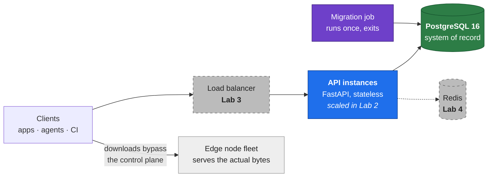

# CDN Control Plane API

Orchestration and management backend for a network of distributed edge nodes.

This service is the **brain** of a CDN, not its muscle. It never serves the content bytes.
It keeps the registry of thousands of edge servers, ingests their telemetry, decides which
node a client should download from, governs where content may be cached, and broadcasts
cache invalidations across the fleet.

> **Course:** Інженерія високонавантажених систем · **Lab 1** — System design and baseline
> prototype. The domain is fixed for the whole course; Labs 2–5 extend this codebase.

---

## Why this domain

The brief asks for a system with a genuine high-load profile. A CDN control plane has two
of them, pulling in opposite directions, and that tension is what makes every later lab
meaningful rather than academic:

| | Write-intensive | Read-intensive |
|---|---|---|
| Endpoint | `POST /nodes/{id}/heartbeat` | `GET /routing/resolve` |
| Driven by | Fleet size ÷ heartbeat interval | End-user download volume |
| At 10 000 nodes / 10 s | ~1 000 writes per second, constant | Millions of reads, bursty |
| Limited by | Physics — every write must reach disk | Repetition — the same answer recomputed |
| Answer | Make each write cheaper | Stop recomputing: cache (Lab 4) |

That asymmetry is the through-line of the whole project: **Lab 4 attacks the reads, Lab 5
measures the writes.**

### Peak load scenario — the *release storm*

The system's worst moment is a content release, because it lights up both sides at once:

1. CI publishes a new asset version → every replica is invalidated and a purge campaign
   opens against every node holding it.
2. The whole fleet acknowledges the purge — a write burst proportional to fleet size.
3. Simultaneously every client calls `/routing/resolve`, and for a window **no node is
   warm**, so routing must keep answering while the fleet re-pulls from origin.
4. Re-pulling spikes node bandwidth → raises reported load → changes routing eligibility.
   The write storm and the read storm feed each other.

Reproduced as Scenario C in the Lab 5 load tests.

---

## Quick start

One command, from a clean clone. No manual steps.

```bash
docker compose --profile demo up -d --build
```

That starts PostgreSQL, waits for it to be healthy, runs migrations **once** in a
dedicated container, seeds a deterministic demo fleet, starts the API, and launches a
simulator standing in for the agents that would run on real edge servers.

That last piece matters. Real edge nodes heartbeat continuously; a seeded database has
the nodes but not the agents, so without it every node ages past
`HEARTBEAT_STALE_AFTER_SECONDS` and routing correctly reports that none is reachable.
The `agents` service supplies the missing half of the simulation rather than hiding the
symptom behind an inflated staleness threshold.

```
http://localhost:8000/docs         interactive API documentation
http://localhost:8000/health       liveness
http://localhost:8000/health/ready readiness (verifies the database)
localhost:5434                     PostgreSQL, if you want to inspect it directly
```

`--profile demo` only gates `seed`: drop it to start with an empty database instead of
the demo fleet. `agents` is **not** profile-gated — it runs unconditionally (harmlessly,
against an empty database it just finds nothing to refresh) specifically so that a plain
`docker compose down`, with no flags, always sees and stops it. `agents` runs with
`restart: unless-stopped` to survive the readiness demo's `docker compose stop postgres`,
and a profile-gated service with that restart policy would be a trap: a `down` invocation
that didn't happen to include the matching `--profile` flag would leave it running and
orphan the network ("Resource is still in use").

Verify it end to end — registers a region, a node and an asset, reports telemetry,
resolves a route, publishes a version, watches the purge complete:

```powershell
./scripts/smoke.ps1
```

<details>
<summary>Running without Docker (host Python)</summary>

```bash
python -m venv .venv
.venv/Scripts/pip install -r requirements-dev.txt
cp config/.env.example config/.env
docker compose up -d postgres
.venv/Scripts/python -m alembic upgrade head
.venv/Scripts/python -m scripts.seed
.venv/Scripts/python -m uvicorn app.main:app --reload
```
</details>

> **Port note.** PostgreSQL is published on **5434**, not 5432. On the development machine
> 5432 belongs to a native Windows PostgreSQL service and 5433 to another project's
> container. Inside the Compose network everything still uses `postgres:5432`.
> Host port **8080 is deliberately left free** for the Lab 3 load balancer.

---

## Architecture

Full breakdown, C4 diagrams and data flows: **[docs/architecture.md](docs/architecture.md)**



### Layout

```
app/
  core/        config, instance identity, JSON logging, middleware, RFC 9457 errors, pagination
  db/          declarative base with naming convention, async engine and pooled sessions
  models/      8 SQLAlchemy models
  schemas/     Pydantic request/response contracts
  services/    all business logic — routes never touch the ORM directly
  api/routes/  HTTP layer: parse, delegate, shape a response
migrations/    Alembic (async), one verified migration
scripts/       deterministic seed, edge-agent simulator, OpenAPI export, smoke test
tests/         39 tests against a real PostgreSQL database
docker/        multi-stage Dockerfile, non-root, with HEALTHCHECK
docs/          architecture · data model · API reference · bottleneck analysis · openapi.json
```

**Why the service layer exists:** Lab 4 wraps caching around *services*, not routes. Had
the business logic lived in route handlers, adding a cache would mean editing every
endpoint.

---

## Domain model

Eight entities. Full ER diagram, column semantics and index rationale:
**[docs/data-model.md](docs/data-model.md)**

| Entity | Role |
|---|---|
| `regions` | Geographic zones; drive proximity scoring |
| `edge_nodes` | The managed fleet, with denormalized live telemetry |
| `node_heartbeats` | Append-only telemetry — the write-intensive table |
| `assets` | Content metadata: hash, size, version, TTL |
| `distribution_rules` | Where an asset may be cached |
| `asset_replicas` | Which node holds which version — what routing joins on |
| `purge_events` | Tracked invalidation campaigns |
| `purge_acknowledgements` | Per-node confirmation, idempotent by primary key |

Two decisions worth noting:

- **`node_heartbeats` uses a `BIGINT` identity key, not a UUID.** Random UUIDs scatter
  inserts across the whole index; a monotonic key keeps every insert on the rightmost
  B-tree page. On the table taking the highest insert rate in the system, that dominates.
- **Node liveness is a SQL predicate, never a background timer.** Staleness is evaluated
  as `last_heartbeat_at >= now() - threshold` inside the routing query. No instance owns a
  reaper loop, so every instance reaches the same verdict without coordinating — which is
  why Lab 2 needs no change here.

---

## API

25 operations across 17 paths. Full reference with status codes and the error catalogue:
**[docs/api.md](docs/api.md)** · machine-readable: [docs/openapi.json](docs/openapi.json)
· live: `/docs`

| Group | Endpoints |
|---|---|
| **Ops** | `GET /health` · `GET /health/ready` |
| **Regions** | `GET`/`POST /api/v1/regions` |
| **Nodes** | `GET`/`POST /nodes` · `GET`/`PATCH`/`DELETE /nodes/{id}` · **`POST /nodes/{id}/heartbeat`** · `GET /nodes/{id}/replicas` · `PUT /nodes/{id}/replicas/{asset_id}` |
| **Assets** | `GET`/`POST /assets` · `GET`/`DELETE /assets/{id}` · **`POST /assets/{id}/versions`** · `GET`/`PUT /assets/{id}/distribution` |
| **Routing** | **`GET /routing/resolve`** |
| **Purges** | `GET`/`POST /purges` · `GET /purges/{id}` · `POST /purges/{id}/acknowledgements` |
| **Stats** | `GET /stats/network` |

The three bold endpoints are where the system's character lives.

### `GET /routing/resolve` — the read hot path

Ranked edge nodes for one asset, computed entirely inside PostgreSQL — the application
never materialises the fleet in memory and never sorts in Python. Query count is constant
(2–3) regardless of fleet size: no N+1.

```
score = proximity_penalty            (0 same region | 25 same continent | 60 otherwise)
      + cold_penalty                 (0 if the node holds the current version | 40 if not)
      + 0.5 * current_load_percent   (0 .. 50)
```

Proximity outranks load because for a CDN distance is the whole product. The cold penalty
sits *between* the proximity tiers, so a warm node one continent away still beats a cold
node next door — an origin pull costs more than the extra network distance.

```bash
curl "http://localhost:8000/api/v1/routing/resolve?path=/static/app.bundle.js&client_region=eu-central&limit=3"
```

```
edge-eu-central-01   score 11.0   same region as client; holds the current version; 22% loaded
edge-eu-central-02   score 28.5   same region as client; holds the current version; 57% loaded
edge-eu-west-02      score 31.0   same continent, serving eu-central from eu-west; 12% loaded
```

`edge-eu-central-03` is absent — it reported 91% load and was automatically demoted to
`degraded`. Every candidate carries a readable `reason`, because a routing decision that
cannot be explained cannot be debugged.

### `POST /nodes/{id}/heartbeat` — the write hot path

One transaction, two statements: append a telemetry row, update the node's denormalized
liveness columns. Load is `max(cpu, memory, bandwidth ÷ capacity)` — the worst signal wins.
Crossing the overload threshold demotes the node to `degraded` and it stops receiving
traffic; dropping back promotes it. **That is the "automatically eject overloaded servers"
requirement**, with no operator action and no background job.

### `POST /assets/{id}/versions` — cross-entity business logic

Publishing new content does three things in **one transaction**: bumps the version, marks
every replica stale, and opens a purge campaign against the nodes holding it. Any partial
outcome would leave edge nodes serving bytes the control plane believes are gone.

The asset row is locked `FOR UPDATE` for the duration — two concurrent CI pipelines would
otherwise both read version N and both write N+1, losing a release.

---

## Bottleneck analysis

Six predicted degradation points in *Component / Root Cause / Symptoms* form, with
mitigations: **[docs/bottlenecks.md](docs/bottlenecks.md)**

| # | Component | Root cause | First symptom | Addressed in |
|---|---|---|---|---|
| 1 | `node_heartbeats` insert storm | WAL + index write amplification, autovacuum lag | p99 write latency, table bloat | Lab 5 measures; partitioning after |
| 2 | `edge_nodes` hot-row update | Row lock contention, MVCC churn | Lock waits, per-node tail latency | Lab 5 |
| 3 | `/routing/resolve` join | Uncached recomputation on the hottest read | DB CPU saturates before the app does | **Lab 4** |
| 4 | Connection pool | `(pool + overflow) × instances` vs `max_connections` | Queueing latency with *falling* DB CPU | Lab 3 raises it, Lab 5 sizes it |
| 5 | Synchronous purge fan-out | O(fleet) work inside one HTTP request | Timeouts, head-of-line blocking | later lab (broker) |
| 6 | Unbounded reads and aggregates | Full scans, `OFFSET` pagination, `COUNT(*)` | Memory spikes, slow deep pages | mitigated now; Lab 4 caches stats |

These are hypotheses derived from the architecture. Lab 5 confirms or refutes them with
numbers — a prediction that turns out wrong is a more useful result than one never tested.

---

## Module ownership

Solo project; every module is authored and defended by one person.

| Module | Files | Owner | Responsible for |
|---|---|---|---|
| Domain and data model | `app/models/`, `migrations/` | Kateryna Ostrovska | Entity design, indexes, constraints, migration correctness |
| Service layer | `app/services/` | Kateryna Ostrovska | Routing algorithm, telemetry ingest, purge lifecycle, transaction boundaries |
| API layer | `app/api/`, `app/schemas/` | Kateryna Ostrovska | REST design, validation, RFC 9457 error contract, OpenAPI |
| Platform | `app/core/`, `app/db/` | Kateryna Ostrovska | Configuration, logging, middleware, pooling, statelessness discipline |
| Infrastructure | `docker/`, `docker-compose.yml` | Kateryna Ostrovska | Containerization, one-command deploy, migration ordering |
| Quality | `tests/`, `.pre-commit-config.yaml` | Kateryna Ostrovska | Test suite, lint and format gates |
| Documentation | `docs/`, `README.md` | Kateryna Ostrovska | Architecture, data model, API reference, bottleneck analysis |

---

## Verification

Everything below was executed against the running stack.

| Check | Command | Result |
|---|---|---|
| Cold start, one command | `docker compose --profile demo up -d --build` | postgres healthy → migrate exit 0 → seed exit 0 → api healthy → agents running |
| Fleet stays routable unattended | left running past the staleness threshold | `/routing/resolve` still `200`; the `agents` service keeps telemetry fresh with no manual step |
| Liveness / readiness | `curl /health`, `curl /health/ready` | `200` / `200` |
| Readiness fails correctly | `docker compose stop postgres` | `/health` stays `200`, `/health/ready` returns `503` problem+json; both recover on restart |
| End-to-end business flow | `./scripts/smoke.ps1` | 14 steps, all expected status codes |
| **Data persistence** | `docker compose restart postgres` | 13 nodes / 9 assets / 74 replicas before **and** after; pool reconnects automatically |
| Migration integrity | `alembic upgrade head` → `check` → `downgrade base` → `upgrade head` | Applies, no drift, tears down and re-applies cleanly |
| Tests | `pytest` | **39 passed** |
| Lint and format | `ruff check .` · `ruff format --check .` | clean · 65 files formatted |

```bash
.venv/Scripts/python -m pytest                    # 39 tests against real PostgreSQL
.venv/Scripts/python -m ruff check .
.venv/Scripts/python -m alembic check             # no model/schema drift
.venv/Scripts/pre-commit install                  # one-time, registers the git hook
.venv/Scripts/python -m scripts.export_openapi    # regenerate docs/openapi.json
```

Tests run against a real PostgreSQL instance, not SQLite: the schema relies on native enum
types, `INET` and `INSERT ... ON CONFLICT`, so a suite on a different engine would prove
very little about the code that ships.

### Defence checklist

1. `docker compose down -v` then `docker compose --profile demo up -d --build` — cold deploy
2. `./scripts/smoke.ps1` — well past the required five endpoints, with status codes asserted
3. `docker compose restart postgres`, re-query — data persistence
4. `docker compose stop postgres`, show `/health` `200` vs `/health/ready` `503`
5. Show `edge-eu-central-03` (91% load) missing from routing — automatic ejection
6. Resolve `/downloads/patch-eu-2026.bin` from `client_region=us-east` — only EU nodes
   returned, proving the distribution policy holds

---

## Roadmap — and what Lab 1 already built for it

Lab 1 was designed so the next four labs are additions and configuration, not rewrites.

| Lab | Needs | Already in place |
|---|---|---|
| **2** — Stateless | State audit, ≥2 instances, `X-Instance-ID`, kill-an-instance test | Statelessness rules documented and enforced (the audit should find nothing to remove); `X-Instance-ID` on every response; staleness in SQL rather than a local reaper; `api` has no `container_name`, so `--scale` works; one-shot `migrate` service means N replicas never race on DDL |
| **3** — Load balancing | nginx upstream pool, health checks, algorithm comparison, node-failure demo | API already containerized with its own `HEALTHCHECK`; `/health` and `/health/ready` already distinguish liveness from readiness and `503` is verified real; port 8080 reserved; deterministic seed makes 1 vs 2 vs 3 instance runs comparable |
| **4** — Distributed caching | Cache-aside, key scheme, TTL, invalidation, `X-Cache`, Redis-down fallback | `CacheBackend` protocol + `NullCache` + `cache_key()` already implementing `cdn:v1:<entity>:<identity>:<params_hash>`; `X-Cache` header already emitted; per-asset `cache_ttl_seconds` column; mutations already funnel through services where invalidation hooks belong; two targets already identified and justified |
| **5** — Load testing | k6 scenarios A/B/C, percentiles, saturation point, scaling and caching comparisons | Scenario A = `/routing/resolve`, B = `/nodes/{id}/heartbeat`, C = publish → purge → ack; idempotent UUIDv5 seed so scripts can hardcode ids and every run starts identical; structured JSON logs carrying `instance_id` and `duration_ms`; pool knobs exposed as env vars so "pool exhaustion" is a testable hypothesis |

Adding Redis in Lab 4 means writing `RedisCache` and changing **one dependency provider** —
no call site changes.

---

## Tech stack

Python 3.13 · FastAPI · SQLAlchemy 2.0 (async) · asyncpg · Alembic · PostgreSQL 16 ·
Pydantic v2 · Docker Compose · pytest · Ruff · pre-commit

Rationale and rejected alternatives: [docs/architecture.md](docs/architecture.md#technology-choices)
