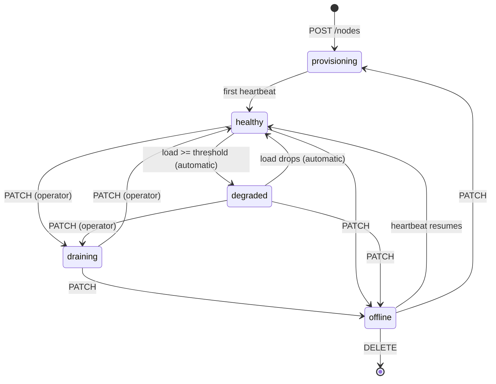

# API Reference

25 operations across 17 paths. Live interactive docs at `http://localhost:8000/docs`;
the committed machine-readable spec is [openapi.json](openapi.json).

Business endpoints live under `/api/v1`. Health endpoints deliberately sit **outside**
the version prefix: they are infrastructure, polled by the container runtime and (from
Lab 3) by the load balancer, and must not move when the API version does.

## Conventions

| Aspect | Rule |
|---|---|
| Media type | `application/json`; errors use `application/problem+json` (RFC 9457) |
| Pagination | `?limit=&offset=` on every collection. Default 50, **hard cap 200** — a caller cannot raise it |
| Collection shape | `{"items": [...], "total": n, "limit": n, "offset": n}` |
| Identifiers | UUID everywhere a client addresses a resource |
| Timestamps | RFC 3339 with timezone |
| Creation | `201` + `Location` header when the resource exists on return |
| Acceptance | `202` when the record is created but the real-world effect is still in flight |
| Every response | `X-Instance-ID`, `X-Request-ID`, `X-Response-Time-ms` |
| Cached paths | additionally `X-Cache: HIT | MISS | BYPASS` (Lab 1 always reports `BYPASS`) |

### Why 202 in three places

`POST /nodes/{id}/heartbeat`, `POST /purges` and `DELETE /assets/{id}` all answer **202
Accepted** rather than 200/201/204. In each case the database write is synchronous and
complete, but the *consequence* is not: telemetry has been recorded yet its fleet-wide
effects are observed elsewhere, and a purge is only really done when the targeted nodes
acknowledge it. Returning 201 for a purge would claim the content is already gone from
the edge. It is not.

## Operations

### Ops

| Method | Path | Purpose | Codes |
|---|---|---|---|
| `GET` | `/health` | Liveness. Checks nothing else — a liveness probe that touched the database would restart every instance when the database blips, turning a recoverable fault into a fleet outage | `200` |
| `GET` | `/health/ready` | Readiness. Executes `SELECT 1`; returns `503` when the database is unreachable. This is what the Lab 3 balancer polls | `200` `503` |

### Regions

| Method | Path | Purpose | Codes |
|---|---|---|---|
| `GET` | `/api/v1/regions` | List regions | `200` |
| `POST` | `/api/v1/regions` | Register a region | `201` `409` `422` |

### Nodes — the fleet

| Method | Path | Purpose | Codes |
|---|---|---|---|
| `GET` | `/api/v1/nodes` | List nodes; filter by `region`, `status` | `200` `422` |
| `POST` | `/api/v1/nodes` | Register a node (enters `provisioning`) | `201` `404` `409` `422` |
| `GET` | `/api/v1/nodes/{node_id}` | Node detail with live telemetry | `200` `404` |
| `PATCH` | `/api/v1/nodes/{node_id}` | Change status (e.g. drain), capacity or agent version | `200` `404` `409` `422` |
| `DELETE` | `/api/v1/nodes/{node_id}` | Decommission; cascades telemetry and replicas | `204` `404` |
| `POST` | `/api/v1/nodes/{node_id}/heartbeat` | **Write hot path** — report telemetry | `202` `404` `422` |
| `GET` | `/api/v1/nodes/{node_id}/replicas` | What this node has cached | `200` `404` |
| `PUT` | `/api/v1/nodes/{node_id}/replicas/{asset_id}` | Agent reports its cache state for one asset | `200` `404` `422` |

**Node lifecycle.** Transitions are validated; an illegal one returns `409` with the
permitted set in `allowed_transitions`.



Only `healthy` nodes are routable. `degraded` is entered and left automatically from the
node's own telemetry — that *is* the "automatically eject overloaded servers" requirement.
`draining` is an operator decision and a healthy-looking heartbeat will never override it.

**Load derivation:** `load = max(cpu_percent, memory_percent, bandwidth_out ÷ capacity × 100)`.
The worst signal wins — a node saturating its uplink is as unusable as one pinned at 100%
CPU, and routing needs one comparable scalar rather than three thresholds on the hot path.

### Assets and distribution

| Method | Path | Purpose | Codes |
|---|---|---|---|
| `GET` | `/api/v1/assets` | List assets; filter by `path_prefix`, `status` | `200` `422` |
| `POST` | `/api/v1/assets` | Register content metadata | `201` `409` `422` |
| `GET` | `/api/v1/assets/{asset_id}` | Asset detail | `200` `404` |
| `POST` | `/api/v1/assets/{asset_id}/versions` | **Publish a new version** — bumps version, marks every replica stale, opens a purge | `201` `404` `409` `422` |
| `DELETE` | `/api/v1/assets/{asset_id}` | Archive and purge from the edge; returns the purge campaign | `202` `404` |
| `GET` | `/api/v1/assets/{asset_id}/distribution` | Current regional policy | `200` `404` |
| `PUT` | `/api/v1/assets/{asset_id}/distribution` | Replace the whole policy (idempotent) | `200` `404` `422` |

`POST .../versions` is the cross-entity business operation: three effects in one
transaction, returning the new asset state, how many replicas were invalidated, and the
`purge_event_id` to follow. It is a POST to a sub-collection rather than a PATCH on the
asset because it creates two new things — a version and a purge campaign.

Republishing an identical `content_hash` returns `409`: there is nothing to release, and
silently bumping the version would invalidate the entire fleet's cache for no reason.

Distribution policy is a full-body `PUT` rather than per-rule POST/DELETE so a CI pipeline
can declare the desired state repeatedly without accumulating duplicates. **No enabled
rule means "cacheable everywhere"**; one or more rules turn it into an allow-list.

### Routing — the read hot path

| Method | Path | Purpose | Codes |
|---|---|---|---|
| `GET` | `/api/v1/routing/resolve` | Ranked edge nodes for an asset | `200` `404` `422` `503` |

Query parameters: `path` (required), `client_region`, `limit` (default 3, max 10).

Eligibility, all evaluated in one SQL statement:

1. node status is `healthy`
2. last heartbeat newer than `HEARTBEAT_STALE_AFTER_SECONDS`
3. `current_load_percent` below `NODE_OVERLOAD_THRESHOLD_PERCENT`
4. the node's region is permitted by the asset's distribution policy

Ranking, lower wins:

```
score = proximity_penalty            (0 same region | 25 same continent | 60 otherwise)
      + cold_penalty                 (0 if node holds the current version | 40 if not)
      + 0.5 * current_load_percent   (0 .. 50)
```

Ties break on capacity, then node id, so the result is deterministic.

Nodes without the content are still returned, flagged `cache_state: "cold"` — they will
pull from origin on first request. Returning a cold nearby node beats returning nothing.
`503` means the network genuinely has no eligible node; `404` means the path is not a
published asset.

Every candidate carries a human-readable `reason`. A routing decision that cannot be
explained cannot be debugged when a client complains about being sent to the wrong
continent.

<details>
<summary>Example response</summary>

```json
{
  "asset_id": "79a2c92f-51bd-5141-8491-055433e9d143",
  "origin_path": "/static/app.bundle.js",
  "version": 1,
  "content_hash": "bd1da32e89d4550ab7a4b4bbb8060056bd1da32e89d4550ab7a4b4bbb8060056",
  "cache_ttl_seconds": 3600,
  "client_region": "eu-central",
  "candidates": [
    {
      "hostname": "edge-eu-central-01",
      "public_ipv4": "203.0.113.10",
      "region_code": "eu-central",
      "capacity_mbps": 40000,
      "current_load_percent": 22,
      "cache_state": "warm",
      "score": 11.0,
      "reason": "same region as client; holds the current version; 22% loaded"
    },
    {
      "hostname": "edge-eu-west-02",
      "region_code": "eu-west",
      "current_load_percent": 12,
      "cache_state": "warm",
      "score": 31.0,
      "reason": "same continent, serving eu-central from eu-west; holds the current version; 12% loaded"
    }
  ]
}
```
</details>

### Purges — distributed invalidation

| Method | Path | Purpose | Codes |
|---|---|---|---|
| `GET` | `/api/v1/purges` | List campaigns; filter by `status` | `200` `422` |
| `POST` | `/api/v1/purges` | Open a campaign — scope `asset`, `region` or `global` | `202` `404` `422` |
| `GET` | `/api/v1/purges/{purge_id}` | Progress: `acknowledged_count` of `target_node_count` | `200` `404` |
| `POST` | `/api/v1/purges/{purge_id}/acknowledgements` | A node confirms it acted | `200` `404` |

Offline nodes are excluded from the target set. Including them would make the target count
unreachable and leave every purge permanently in progress, since a node that is down cannot
acknowledge anything — and a node that comes back does so with a cold or revalidated cache,
which is the end state the purge wanted anyway.

Acknowledgement is idempotent through the composite primary key, so an agent retrying after
a timeout cannot inflate the tally. The campaign completes at `n/n`, or reports
`partially_failed` if any node answered `failed` or `not_found`.

### Stats

| Method | Path | Purpose | Codes |
|---|---|---|---|
| `GET` | `/api/v1/stats/network` | Fleet, content and purge aggregates | `200` |

Four grouped aggregates over the largest tables. Intentionally uncached in Lab 1 — it is
the reference workload for Lab 4, and caching it now would hide the cost it exists to
demonstrate.

## Error format — RFC 9457

Every failure, including validation failures, uses the same shape. A client should not have
to parse two formats depending on whether the problem was structural or a business rule.

```json
{
  "type": "https://cdn-control-plane.local/problems/state-conflict",
  "title": "Conflicting Resource State",
  "status": 409,
  "detail": "Illegal status transition 'provisioning' -> 'draining'.",
  "instance": "/api/v1/nodes/8ff79190-90c2-408b-8b76-c719ae01090a",
  "request_id": "19393608c41641ecaa20291aaa2d2d37",
  "allowed_transitions": ["healthy", "offline"]
}
```

`request_id` matches the `X-Request-ID` header and the structured log line, so a user-reported
failure can be traced to the exact request on the exact instance that served it.

| Status | `type` slug | Raised when |
|---|---|---|
| `404` | `resource-not-found` | Referenced region, node, asset or purge does not exist |
| `409` | `state-conflict` | Duplicate hostname or origin path, illegal status transition, republished identical hash |
| `422` | `request-validation-failed` | Malformed request — body, query or path |
| `422` | `business-rule-violation` | Well-formed but invalid: unknown region in a policy, replica version ahead of published |
| `503` | `service-unavailable` | Database unreachable (readiness), or no eligible edge node (routing) |

Problem responses carry extra fields where they help a caller recover: `allowed_transitions`
on an illegal transition, `unknown_region_codes` on a bad policy, `errors` on a validation
failure, `max_limit` on an oversized routing limit.
