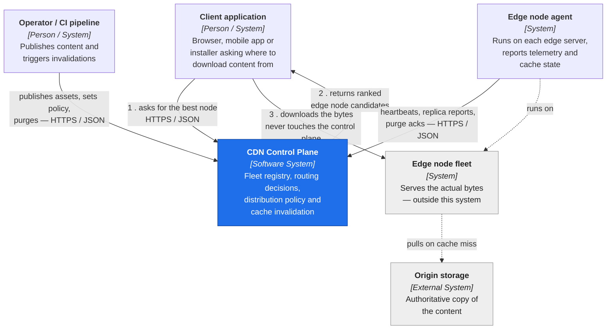
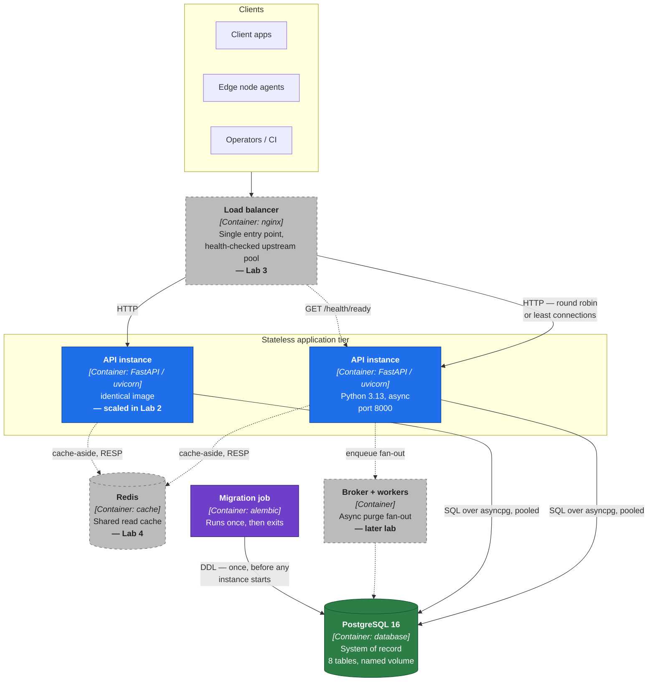
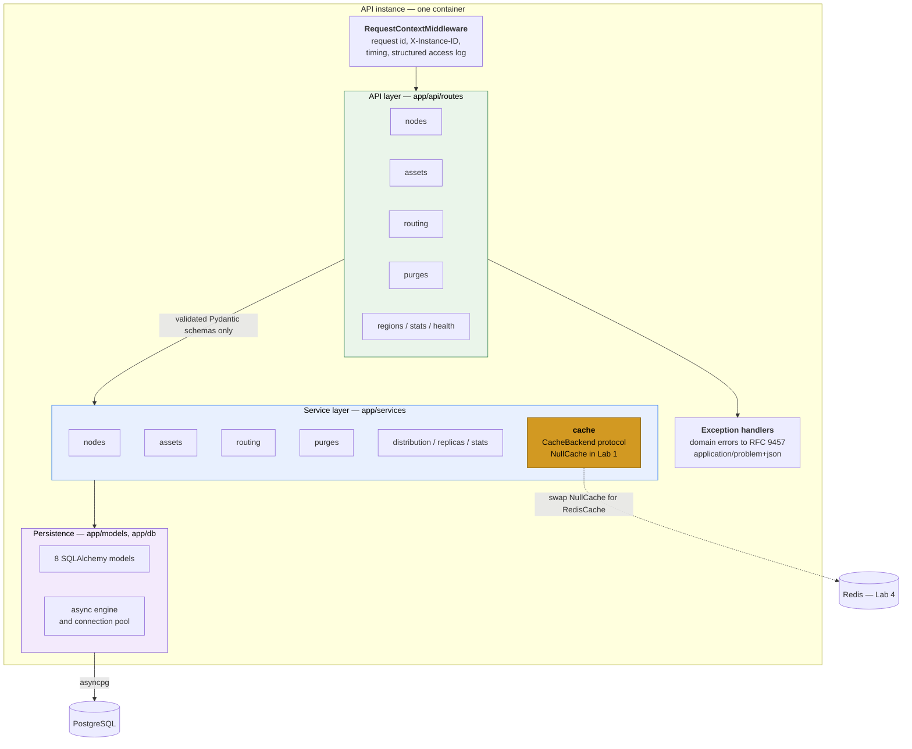
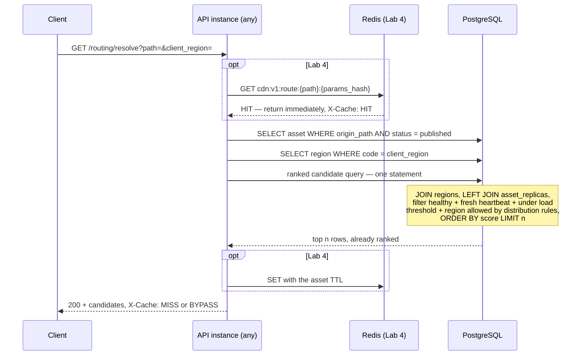

# System Architecture

## What this system is

The **CDN Control Plane** is the orchestration backend of a content delivery network.
It manages thousands of geographically distributed **Edge Nodes**: it knows which are
alive, how loaded they are, what content each one holds, and which node a given client
should be sent to.

It is explicitly **not** a data plane. It never serves the content bytes. The heavy
transfer happens directly between a client and the edge node this service points it at.
Everything here is metadata, decisions and coordination — which is why a single
relational database can be the system of record for a network moving terabytes.

## The load profile that drives every decision

The control plane is pulled in two directions at once, and the whole design is a
response to that:

| | Write-intensive side | Read-intensive side |
|---|---|---|
| **Traffic** | `POST /nodes/{id}/heartbeat` | `GET /routing/resolve` |
| **Source** | Every edge node, continuously | Every client, before every download |
| **Volume** | fleet size ÷ heartbeat interval | proportional to end-user traffic |
| **Shape** | Small, constant, unavoidable, append-heavy | Small, bursty, latency-critical |
| **Cost centre** | WAL and index writes, hot-row updates | Multi-table join, DB CPU |
| **Scaling answer** | Append-only table, monotonic key, one transaction | In-database ranking, then a cache (Lab 4) |

### Peak scenario: the *release storm*

The worst moment for this system is a content release, because it lights up both sides
simultaneously:

1. A CI pipeline publishes a new version of a popular asset
   (`POST /assets/{id}/versions`).
2. Every replica of that asset is invalidated in one transaction and a purge campaign
   opens against every node holding it.
3. All those nodes discover the change and acknowledge the purge
   (`POST /purges/{id}/acknowledgements`) — a burst of writes proportional to fleet size.
4. Meanwhile, every client that wants the asset hits `GET /routing/resolve`, and for a
   short window *no node is warm*, so routing has to keep answering while the whole
   fleet re-pulls from origin.
5. The re-pull spikes node bandwidth, which raises reported load values, which changes
   routing eligibility — the write storm and the read storm feed each other.

This scenario is what the Lab 5 load tests are built to reproduce (Scenario C).

## C4 Level 1 — System context



The key line is **3**: the download never passes through this system. That is what makes
a control plane tractable — it handles one small request per download, not the download.

## C4 Level 2 — Containers

Solid fills are implemented in Lab 1. Dashed borders are designed for but deferred to a
named later lab.



### Why a separate one-shot migration container

If migrations ran on application startup, `docker compose up --scale api=3` would start
three processes that all try to run the same DDL against the same database at the same
moment. The one that wins holds a lock; the others either fail or observe a partial
schema. Splitting migration into its own service that runs once and exits — with the API
depending on `service_completed_successfully` — removes the race by construction, before
Lab 2 ever needs to scale anything.

## C4 Level 3 — Components inside one API instance



**Why the service layer exists:** routes do HTTP (parse, delegate, shape a response),
services do business logic. Lab 4 wraps caching around *services*, not routes — so the
cache benefits every caller, and invalidation hooks sit next to the mutations that must
trigger them. Had the logic lived in route handlers, adding a cache would mean editing
every endpoint.

## Statelessness rules — the Lab 2 audit, decided up front

The application holds **no business state in process memory**. The codebase obeys these
rules, so the Lab 2 state audit should find nothing left to remove:

| Rule | Why |
|---|---|
| No module-level mutable collections | A dict of nodes in one instance is invisible to the other two |
| No singletons holding business data | Same problem, harder to spot in review |
| `@lru_cache` only over immutable configuration | `get_settings()` and `get_instance_id()` qualify; nothing else does |
| No in-process schedulers or reaper loops | Node staleness is a SQL predicate (`last_heartbeat_at >= now() - threshold`), so every instance reaches the same verdict without coordinating |
| No local file or session storage | Nothing is lost when a container is killed |
| No sticky sessions | Any instance can serve any request; the only per-request state lives on the `Request` object |

The only per-process state is the SQLAlchemy connection pool and the logging
configuration — both **Ephemeral / Local Safe** in the Lab 2 taxonomy.

`X-Instance-ID` is emitted on every response so it is *observable* which instance served
a request, but no business logic may read it. Identification is diagnostics; affinity
would be a bug.

## Key data flows

### Telemetry ingest — write hot path

```mermaid
sequenceDiagram
    participant Agent as Edge node agent
    participant API as API instance (any)
    participant DB as PostgreSQL

    Agent->>API: POST /nodes/{id}/heartbeat
    API->>DB: SELECT node — capacity, current status
    Note over API: load = max(cpu, memory, bandwidth/capacity)<br/>status: at or above threshold then degraded,<br/>else healthy; draining is never overridden
    API->>DB: BEGIN
    API->>DB: INSERT node_heartbeats (append-only)
    API->>DB: UPDATE edge_nodes SET last_heartbeat_at, load, status
    API->>DB: COMMIT
    API-->>Agent: 202 Accepted + next_heartbeat_in_seconds
```

An overloaded node demotes *itself* through its own telemetry, and a recovered node
promotes itself back. No operator action, no background job, no cross-instance
coordination.

### Route resolution — read hot path



The scoring is **entirely in SQL**. The application never loads the fleet into memory and
never sorts in Python, so response time is a function of index selectivity rather than
fleet size. Query count is constant (2–3) regardless of how many nodes, replicas or rules
exist — there is no per-candidate follow-up query, so no N+1.

Score, lower wins:

```
score = proximity_penalty            (0 same region | 25 same continent | 60 otherwise)
      + cold_penalty                 (0 if the node holds the current version | 40 if not)
      + 0.5 * current_load_percent   (0 .. 50)
```

The weights encode two deliberate judgements. Proximity outranks load, because for a CDN
distance is the entire product. The cold penalty sits *between* the proximity tiers, so a
warm node one continent away still beats a cold node next door — an origin pull costs far
more than the extra network distance.

Ties break on capacity, then node id, so the ranking is fully deterministic: the same
fleet state always produces the same answer, which is what makes the Lab 5 measurements
reproducible.

### Content release and invalidation

```mermaid
sequenceDiagram
    participant CI as CI pipeline
    participant API as API instance
    participant DB as PostgreSQL
    participant Agents as Edge node agents

    CI->>API: POST /assets/{id}/versions
    API->>DB: SELECT asset FOR UPDATE
    Note over API,DB: the row lock stops two concurrent releases<br/>both reading version N and both writing N+1
    API->>DB: UPDATE assets SET version + 1, hash, size
    API->>DB: UPDATE asset_replicas SET state = stale
    API->>DB: INSERT purge_events with target_node_count = n
    API->>DB: COMMIT
    API-->>CI: 201 + purge_event_id

    loop each targeted node
        Agents->>API: POST /purges/{id}/acknowledgements
        API->>DB: INSERT ack ON CONFLICT DO NOTHING
        API->>DB: UPDATE purge_events SET acknowledged_count = acknowledged_count + 1
        Note over API,DB: SQL-expression increment, not read-modify-write,<br/>so two instances acking at once cannot lose an update
    end
    API-->>Agents: 200 + progress; status becomes completed at n of n
```

Version bump, replica invalidation and purge creation are **one transaction**. Any partial
outcome would leave edge nodes serving bytes the control plane believes are gone — the
specific failure a CDN cannot tolerate.

## Technology choices

| Choice | Reason | Rejected alternative |
|---|---|---|
| **FastAPI, async** | Both hot paths are I/O-bound — they wait on the database, not on CPU. Async gives high concurrency per instance without a thread per request. Native OpenAPI generation also satisfies the API-documentation requirement. | Django — batteries-included but sync-first, and its ORM is not the strength needed here |
| **PostgreSQL 16** | Routing eligibility is a multi-table join with ordering, i.e. a relational query. Purge accounting needs transactions and constraints. Native enums, `INET`, filtered aggregates and `ON CONFLICT` all pull their weight. | MongoDB — the data is relational; joining in application code would create exactly the N+1 this design avoids |
| **SQLAlchemy 2.0 async + asyncpg** | Typed models for maintainability, with the freedom to drop to Core where the query matters — the routing query is hand-built, not ORM-navigated. | Raw asyncpg — loses migrations and type safety for no gain at this size |
| **Alembic in its own container** | Schema is versioned code, and running it once outside the app removes the multi-replica race described above. | Startup hooks — they break under `--scale` |
| **Ruff + pre-commit** | One tool for lint and format, fast enough to run on every commit. | flake8 + black + isort — three tools, three configs |
| **Mermaid diagrams in Markdown** | Labs 2, 3 and 4 each require an *updated* diagram. Text diagrams diff in review and are edited in minutes. | Exported images — every update means redrawing by hand |

## What Lab 1 deliberately does not build

| Deferred | Why it is not needed yet | Arrives in |
|---|---|---|
| Load balancer (nginx) | Meaningless with one instance. The API is already containerized and already exposes `/health/ready`, so it can join an upstream pool unchanged. Host port 8080 is kept free for it. | Lab 3 |
| Redis cache | Caching before measuring hides the very cost it is meant to remove. The seam — `CacheBackend`, `cache_key()`, the `X-Cache` header — is already in place. | Lab 4 |
| Message broker and workers | Purge fan-out is synchronous today. It is listed as bottleneck #5 precisely because that will not hold at fleet scale. | later lab |
| Object storage for content bytes | The control plane stores a hash and a size, never the artifact itself. | n/a — by design |
| Auth / mTLS for edge agents | Real deployments authenticate agents, but it is orthogonal to the load characteristics this course studies. | out of scope |

Each deferred component appears in the Level 2 diagram with a dashed border, so the
architecture shows the destination while the code shows the current step.
