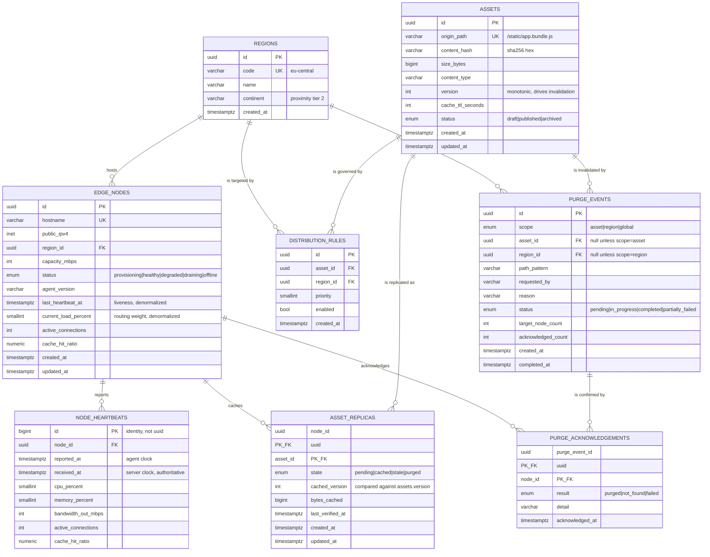

# Data Model

Eight tables in one PostgreSQL schema. The whole model exists to answer one question
fast — *which edge node should this client download this asset from?* — and to keep an
auditable record of how content got there and when it was removed.

## Entity relationship diagram



## Table notes

### `regions`
A small, slowly-changing lookup table. Proximity is modelled as two tiers — same region,
then same continent — rather than latitude/longitude distance. That is deliberately
coarse: it is deterministic, needs no trigonometry on the hot path, and produces a
routing `reason` a human can read. Real geo-distance would be a refinement, not a
correction.

### `edge_nodes`
The fleet registry. Three columns are a **denormalized projection** of the newest
heartbeat: `last_heartbeat_at`, `current_load_percent`, `active_connections`.

This is a conscious trade. Routing must not touch `node_heartbeats` — that table is the
largest and fastest-growing in the schema, and a "latest row per node" lookup across it
on every client request would be the first thing to fall over. Keeping the current state
on the node row turns that into a single indexed scan of a small table.

The cost is that every heartbeat updates the same row for that node, producing one dead
tuple per heartbeat. That is bottleneck #2 in [bottlenecks.md](bottlenecks.md), and it is
the price of a fast read path.

### `node_heartbeats`
The write-intensive table: *fleet size ÷ heartbeat interval* rows per second, append-only,
never updated.

**Why a `BIGINT` identity key here and `UUID` everywhere else.** Random UUIDv4 keys scatter
inserts across the entire index, so each transaction dirties pages all over the B-tree and
the working set grows with the table. A monotonic key keeps every insert on the rightmost
page, which stays in cache. For a table taking the highest insert rate in the system, that
difference dominates. The usual arguments for UUID — client-generatable, non-enumerable,
mergeable across shards — do not apply, because nothing outside the system ever addresses
an individual telemetry sample.

`reported_at` is the agent's clock; `received_at` is the server's. Routing eligibility uses
only server time, so an agent with a skewed clock cannot make itself look fresh.

### `assets`
Content metadata, never content. `version` is the invalidation mechanism: bumping it makes
every `asset_replicas` row whose `cached_version` is lower *implicitly* stale, so the hot
path compares two integers instead of two 64-character hashes.

`cache_ttl_seconds` is per-asset because freshness requirements differ by an order of
magnitude — a product catalogue tolerates 5 minutes, a versioned bundle tolerates a week.
It is already in place for the Lab 4 TTL policy.

### `distribution_rules`
Declares where an asset *may* be cached. **Absence of any enabled rule means "everywhere"**;
as soon as one exists the set becomes an allow-list. This keeps the common case free of
bookkeeping while still supporting the domain requirement that, say, an update bundle be
cached only on European nodes.

`UNIQUE (asset_id, region_id)` prevents the contradictory-duplicate-rules problem entirely.

### `asset_replicas`
The join table the routing decision depends on. The **composite primary key
`(node_id, asset_id)`** is the natural key — a node holds at most one copy of an asset —
so a surrogate id plus a unique index would be two structures doing one job.

`ix_asset_replicas_asset_id_state` mirrors the primary key's column order. The PK serves
"what does this node hold?"; the index serves "who holds this asset?", which is what both
routing and purge fan-out actually ask.

### `purge_events`
A tracked campaign, not a fire-and-forget signal. `target_node_count` and
`acknowledged_count` let an operator answer *"is the old bundle actually gone everywhere?"*
instead of assuming.

The `scope_target_present` CHECK constraint ties the scope to its target column, so a
region-scoped purge with no region cannot exist even if some future caller bypasses the
service layer. The `acknowledged_count <= target_node_count` constraint makes double
counting a database error rather than a silently wrong progress bar.

### `purge_acknowledgements`
The composite primary key makes acknowledgement **idempotent at the storage level**. An
edge agent that retries after a network timeout collides with its own row — handled with
`ON CONFLICT DO NOTHING` — instead of inflating the tally. Idempotency lives in the schema,
not in application-level guesswork.

## Index rationale

| Index | Serves | Without it |
|---|---|---|
| `edge_nodes (region_id, status)` | Routing eligibility; per-region fleet listing | Sequential scan of the fleet on every client request |
| `edge_nodes (status, last_heartbeat_at)` | Staleness evaluation — "healthy nodes that have gone quiet" | Full scan on every route resolution and every stats call |
| `edge_nodes (hostname)` UNIQUE | Registration conflict detection | Duplicate nodes under concurrent registration |
| `node_heartbeats (node_id, received_at DESC)` | Newest samples for one node | Scan of the largest table to read recent telemetry |
| `asset_replicas (asset_id, state)` | "Who holds this asset, and is it current?" | Scan of the replica table per route resolution |
| `assets (origin_path)` UNIQUE | The routing lookup itself; duplicate prevention | Scan on every resolve, plus duplicate paths |
| `assets (status)` | Filtering published content | Minor, but the filter appears on every listing |
| `purge_events (status, created_at DESC)` | Operator view of in-flight campaigns | Scan as purge history accumulates |

The `DESC` ordering on the two time-series indexes matters: it matches the only read
pattern those tables have — newest first — so PostgreSQL can walk the index in order
rather than sorting the result.

## Deliberate constraints

Validation exists twice, on purpose. Pydantic rejects malformed input at the edge with a
useful message; CHECK constraints make the invariant true of the *data*, regardless of
which code path wrote it — a migration, a seed script, a future worker, or a psql session
during an incident.

| Constraint | Invariant |
|---|---|
| `capacity_mbps > 0` | A node with zero capacity would divide by zero in the load calculation |
| `current_load_percent BETWEEN 0 AND 100` | Load is the routing weight; out-of-range values would silently corrupt ranking |
| `cpu_percent`, `memory_percent` in `0..100` | Telemetry sanity at the source |
| `version >= 1` | Version is monotonic and is the invalidation signal |
| `size_bytes >= 0`, `bytes_cached >= 0` | Physical impossibility |
| `acknowledged_count <= target_node_count` | Progress can never exceed the target |
| `scope_target_present` | Every purge scope has the target column it needs |

## Constraint naming convention

`Base.metadata` carries an explicit naming convention (`ix_`, `uq_`, `ck_`, `fk_`, `pk_`
with the table and column names). Without it PostgreSQL invents constraint names and
Alembic autogenerate produces unstable diffs — a real problem once Labs 2 through 4 start
layering migrations on this schema. It also means a constraint violation names itself
clearly in the error message.

## Migration

One migration, `2c3af01d0235_create_cdn_control_plane_schema`, generated by autogenerate
against a live PostgreSQL 16 container and then verified three ways:

```bash
alembic upgrade head      # applies cleanly
alembic check             # reports no drift between models and database
alembic downgrade base    # tears down cleanly, enum types included
alembic upgrade head      # and re-applies
```

The downgrade needed one hand-written addition: autogenerate creates native enum types
alongside the tables but does not drop them, so `DROP TABLE` would leave six orphaned
types behind and the next `upgrade` would fail with *"type already exists"*. The six
`sa.Enum(...).drop(...)` calls at the end of `downgrade()` close that gap.
